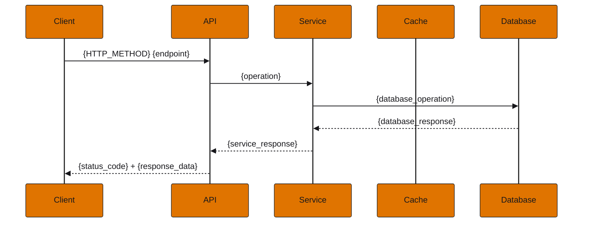

<!-- Generated from issue-forms/user-story-for-api.yml by scripts/render_issue_forms.py. Edit the form, then rerun it. -->

# API User Story

Template for creating detailed API user stories with acceptance criteria, API specs, and metrics

Native issue type: `Feature`. Title: `{{ summarize the user story here }}`.

## Acceptance Criteria

## Sections, in order

Write each as a `### <label>` heading, as GitHub does when the form is filled in.

### Objective

What is the objective of this story?

Starts as:

```markdown
**As** a {user_role},  
**I want** {specific_objective},  
**So that** {benefit_and_value}.
```

For example:

> e.g.: As a developer, I want to create a new user story so that I can track the progress of the story

Required.

### Happy Path Scenario

Describe the success scenario using Gherkin format

Starts as:

```markdown
```gherkin
Scenario: {success_scenario_name}
  Given {pre_condition}
  And {additional_pre_condition}
  When {action}
  Then {expected_result}
  And {additional_result}
  And {result_details}:
    | field  | value  |
    | field1 | value1 |
    | field2 | value2 |
```
```

Required.

### Corner Cases

Describe edge case scenarios using Gherkin format

Starts as:

```markdown
```gherkin
Scenario: {edge_case_name}
  Given {pre_condition}
  When {action}
  Then {expected_result}
  And error code {error_code}
  And reason {error_reason}
```
```

Optional.

### Error Cases

Describe system error scenarios

Starts as:

```markdown
```gherkin
Scenario: Internal server error when {operation}
  Given the service is unstable
  When I try to {operation}
  Then the system should return error 500 Internal Server Error
  And error code ERR500_INTERNAL_ERROR
  And reason INTERNAL_SERVER_ERROR
```
```

Optional.

### Acceptance criteria

Number the scenarios above, one line each: AC-1, AC-2 and upward, never renumbered. A test names the one it covers as #<issue>/AC-<n>.

Starts as:

```markdown
- AC-1: <happy path scenario, in one line>
- AC-2: <corner case>
- AC-3: <error case>
```

Required.

### Left to other issues

Decisions already made, work blocked elsewhere, and parts another issue owns, each by number.

Optional.

### Domain Entities

Define the entities and their fields

Starts as:

```markdown
### Entity: {Entity_Name}

| Field  | Type  | Description  |
|--------|-------|--------------|
| field1 | type1 | description1 |
| field2 | type2 | description2 |
| field3 | type3 | description3 |
```

Optional.

### HTTP Method

Select the HTTP method

One of:

- GET
- POST
- PUT
- PATCH
- DELETE

Required.

### API Path

e.g.: /v1/resource/{identifier}

Starts as:

```markdown
/v1/resource/{identifier}
```

For example:

> /v1/resource/{identifier}

Required.

### API Scopes

e.g.: entity1:action1, entity2:action2

Starts as:

```markdown
entity1:action1, entity2:action2
```

For example:

> entity1:action1, entity2:action2

Required.

### Request Headers

Define the required headers

Starts as:

```markdown
| Field                 | Type    | Required | Value                          | Description                                         |
|-----------------------|---------|----------|--------------------------------|-----------------------------------------------------|
| Accept                | string  | no       | application/vnd.example.v1+json| Expected contract type in response.                 |
| Content-Type          | string  | no       | application/vnd.example.v1+json| Contract type sent in the request.                  |
| Idempotency-Key       | string  | yes/no   | uuid                           | Idempotency key for the request.                    |
| X-Correlation-Id      | string  | no       | uuid                           | Correlation ID for distributed tracing.             |
```

Required.

### Query Parameters

Define the query parameters

Starts as:

```markdown
| Field  | Type  | Required | Default        | Description  |
|--------|-------|----------|----------------|--------------|
| field1 | type1 | yes/no   | default_value  | description1 |
```

Optional.

### Request Body

JSON schema for request body (if applicable)

Starts as:

```markdown
```json
{
  "field1": "value1",
  "field2": "value2"
}
```
```

Optional.

### Response Schema

Define the response schema for success and error

Starts as:

```markdown
**Success:**
```json
{
  "data": {
    "field1": "value1",
    "field2": "value2",
    "field3": "value3"
  }
}
```

**Error:**
```json
{
  "errors": [
    {
      "code": "{{code}}",
      "reason": "{{reason}}",
      "message": "{{message}}"
    }
  ],
  "reference": "https://docs.example.com/api/known-errors/{entity_type}"
}
```
```

Optional.

### Business Metrics

Define the business metrics to be collected

Starts as:

```markdown
- Success rate for {operation}
- Total number of {operation} operations
- Error distribution by type (400, 404, 409, 500, 503)
```

Optional.

### Performance Metrics

Define the performance metrics

Starts as:

```markdown
- Average request latency (p50, p90, p95, p99)
- Database response time
- Throughput rate (requests per second)
- Error rate (%)
```

Optional.

### Infrastructure Metrics

Define the infrastructure metrics

Starts as:

```markdown
- CPU usage
- Memory usage
- Number of concurrent database connections
- Cache hit/miss rate (if applicable)
```

Optional.

### SLIs / SLOs

Define the Service Level Indicators and Objectives

Starts as:

```markdown
- Service availability: 99.99%
- Maximum latency (p99): 50ms
- Maximum error rate: 0.01%
```

Optional.

### Sequence Diagram

Mermaid code for the sequence diagram

Starts as:

```markdown

```

Optional.

### Use Cases

Describe the main use cases

Starts as:

```markdown
### {Use_Case_Title}

**Scenario:** {scenario_description}  
**Challenge:** {challenge_description}  
**Solution:** {solution_description}  
**Benefit:** {benefit_description}
```

Optional.

### References

Links to relevant documentation

Starts as:

```markdown
- [OpenAPI Specification](https://example.com/{project}/{project}.openapi.yaml)
- [Product documentation](https://docs.example.com/)
```

Optional.

## Domain Entities and Schemas

## API Specification

## Metrics
