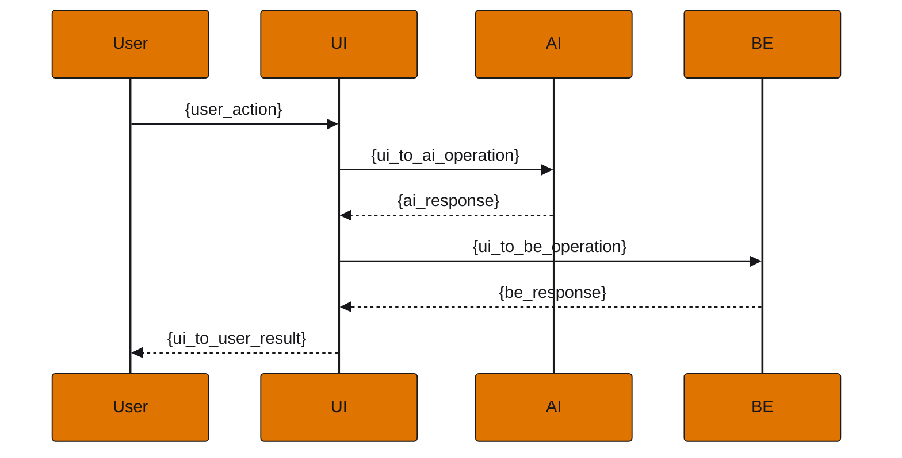
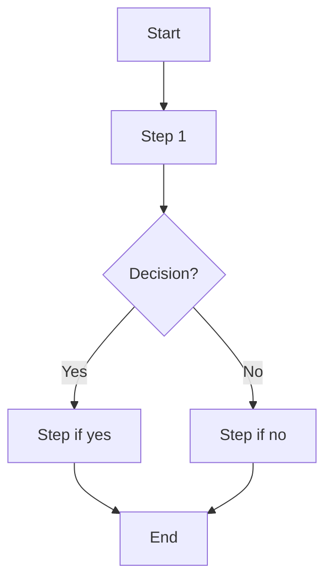

<!-- Generated from issue-forms/user-story-for-frontend.yml by scripts/render_issue_forms.py. Edit the form, then rerun it. -->

# Frontend User Story

Template for creating detailed frontend user stories with acceptance criteria, UI/UX specs, and metrics

Native issue type: `Feature`. Title: `{{ brief feature summary }}`.

Fill in the fields below to register a frontend user story with full specs (aligned to fe-user-story template).

## Sections, in order

Write each as a `### <label>` heading, as GitHub does when the form is filled in.

### As a (user role / persona)

Who is the user/persona?

For example:

> e.g. Controller Analyst

Required.

### I want (specific objective)

What does the persona want?

For example:

> e.g. a daily trial balance view with AI insights

Required.

### So that (benefit and value)

What is the benefit or value for the business?

For example:

> e.g. I can detect accounting discrepancies without opening spreadsheets

Required.

### Happy Path Scenario

Success scenario in Gherkin format

Starts as:

```markdown
```gherkin
Scenario: {success_scenario_name}
  Given {pre_condition}
  And {additional_pre_condition}
  When {action}
  Then {expected_result}
  And {additional_result}
  And {result_details}:
    | field  | value  |
    | field1 | value1 |
    | field2 | value2 |
```
```

Required.

### Corner Cases

Edge case scenarios in Gherkin format

Starts as:

```markdown
```gherkin
Scenario: {edge_case_name}
  Given {pre_condition}
  When {action}
  Then {expected_result}
  And error code {error_code}
  And reason {error_reason}
```
```

Optional.

### Error Cases

System error scenarios in Gherkin format

Starts as:

```markdown
```gherkin
Scenario: {error_scenario_name}
  Given {error_pre_condition}
  When {error_action}
  Then the system should return {error_expected}
  And error code {error_code}
  And reason {error_reason}
```
```

Optional.

### Acceptance criteria

Number the scenarios above, one line each: AC-1, AC-2 and upward, never renumbered. A test names the one it covers as #<issue>/AC-<n>.

Starts as:

```markdown
- AC-1: <happy path scenario, in one line>
- AC-2: <corner case>
- AC-3: <error case>
```

Required.

### Left to other issues

Decisions already made, work blocked elsewhere, and parts another issue owns, each by number.

Optional.

### Domain Entities

Entities and fields (Screen Field (pt-BR), Backend Field, Type, Description)

Starts as:

```markdown
### Entity: {Entity_Name}

| Screen Field (pt-BR) | Backend Field | Type  | Description  |
|---------------|------------------|-------|--------------|
| field1        | field1           | type1 | description1 |
| field2        | field2           | type2 | description2 |
| field3        | field3           | type3 | description3 |
```

Optional.

### Business Metrics

Business metrics

Starts as:

```markdown
- {business_metric_1}
- {business_metric_2}
- {business_metric_3}
```

Optional.

### Performance Metrics

Performance metrics

Starts as:

```markdown
- {performance_metric_1}
- {performance_metric_2}
- {performance_metric_3}
```

Optional.

### UI/UX Metrics

Interface and experience metrics

Starts as:

```markdown
- {ui_ux_metric_1}
- {ui_ux_metric_2}
```

Optional.

### SLIs / SLOs

Service Level Indicators and Objectives

Starts as:

```markdown
- {sli_slo_item_1}
- {sli_slo_item_2}
```

Optional.

### Sequence Diagram

Mermaid code for the sequence diagram (User, UI, AI, BE)

Starts as:

```markdown

```

Optional.

### Flowchart

Mermaid code for the flow (flowchart TD)

Starts as:

```markdown

```

Optional.

### Use Cases

Scenario, challenge, solution and benefit

Starts as:

```markdown
### {Use_Case_Title}

**Scenario:** {scenario_description}
**Challenge:** {challenge_description}
**Solution:** {solution_description}
**Benefit:** {benefit_description}
```

Optional.

### Mockup or prototype code

Code (e.g. React/Tailwind), image or link to prototype

For example:

> Paste component code, image or Miro/Figma prototype link...

Optional.

### References

Links to relevant documentation

Starts as:

```markdown
- [Product documentation](https://docs.example.com/)
- {additional_reference}
```

Optional.

## Objective (User Story)

## Acceptance Criteria

## Domain Entities and Schemas

## Metrics

## Sequence Diagram

## Flowchart (User Journey)

## Use Cases

## Mockup / Prototype

## References
